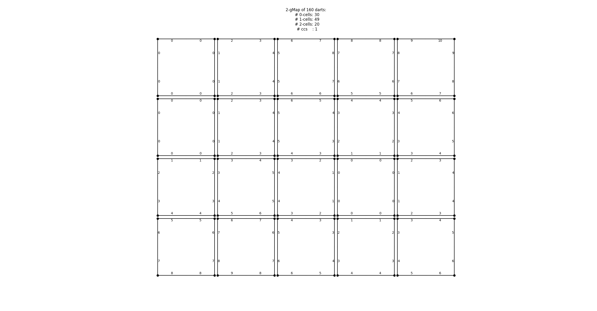
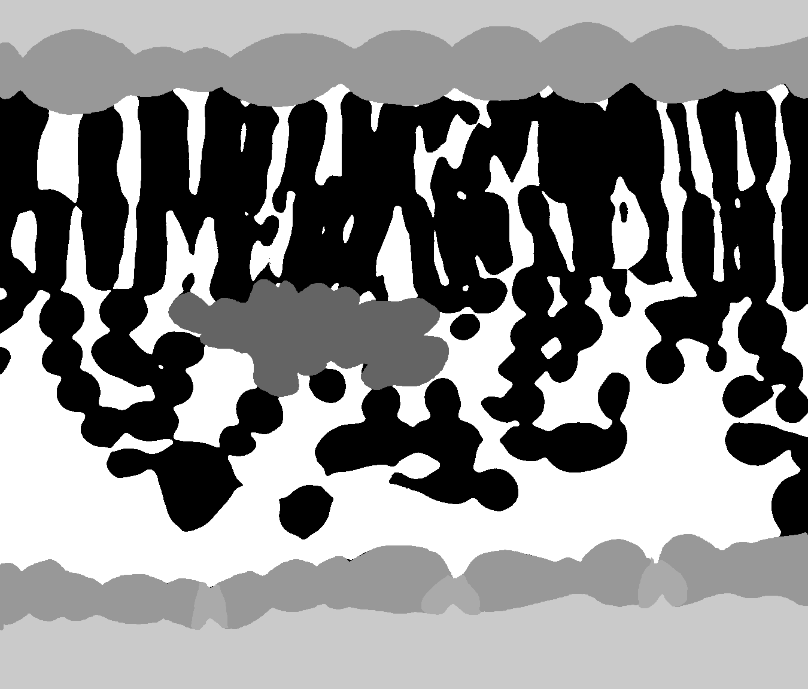
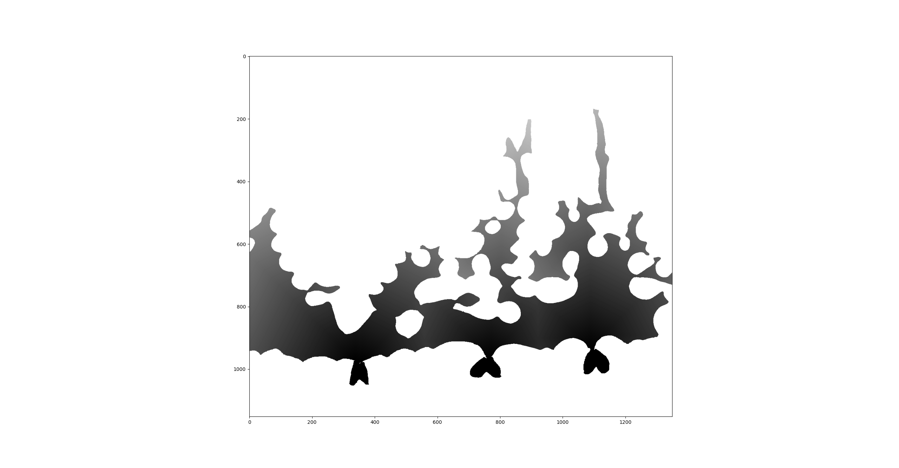

# distance-transforms-on-gmaps

## Distance transforms on gMaps from labels

### Wave propagation on gMaps from labels

To compute the distance transform of gMaps from labels, we can use the wave propagation algorithm.

This algorithm is implemented with `wave_propagation_dt_gmap` function in the `wave_propagation` module in the `distance_transform` package.

This function takes two mandatories arguments `gmap` and `seeds_identifiers` that are the gMap and the seeds of the wave propagation. The optional argument `accumulation_directions` is the directions (involutions of the gMap) of the wave propagation. \
If `seeds_identifiers` is equal to `None`, the algorithm will use the darts with label equal to 0 of the n-Gmaps as the seed. If `accumulation_directions` is not provided, the algorithm will use all the involutions of the n-Gmap as the directions.

5 by 4 n-Gmap distance transform example:

```python
from combinatorial.pixelmap import LabelMap
from combinatorial.zoo_labels import str2labels
from distance_transform.wave_propagation import wave_propagation_dt_gmap

# Create a 5 by 4 n-Gmap that represents an image with 3 lit pixels
G2_IMG = """\
w . . . .
w . . . .
. . . w .
. . . . .
"""

image = str2labels (G2_IMG)

lm_img = LabelMap.from_labels(image, need_to_save_labels=False)

# Plot the distance transform before the wave propagation
lm_img.plot_dt()
```


```python
seeds_identifiers = [
    0, 1, 2, 3, 4, 5, 6, 7,                 # First lit pixel
    40, 41, 42, 43, 44, 45, 46, 47,         # Second lit pixel
    104, 105, 106, 107, 108, 109, 110, 111  # Third lit pixel
]

wave_propagation_dt_gmap(lm_img, seeds_identifiers)

# Plot the distance transform after the wave propagation
lm_img.plot_dt()
```



### Generalized wave propagation on gMaps from images with labels

To compute the distance transform of gMaps from images with labels, we can use the generalized wave propagation algorithm.

This algorithm is implemented with `generalized_wave_propagation_gmap` function in the `wave_propagation` module in the `distance_transform` package.

This function takes four mandatories arguments `gmap`, `seed_labels`, `propagation_labels` and `target_labels` that are the gMap, the labels of the seeds of the wave propagation, the labels of the propagations and the labels of the targets. The optional argument `accumulation_directions` is the directions (involutions of the gMap) of the wave propagation. \
If `accumulation_directions` is not provided, the algorithm will use all the involutions of the n-Gmap as the directions.

Let's consider the following example:

Consider the following image:



```python
from cv2 import imread
from combinatorial.pixelmap import LabelMap
from distance_transform.wave_propagation import generalized_wave_propagation_gmap
from data.labels import labels

image = imread(
    "./../../data/image/DEHYDRATION_small_leaf_4_time_1_ax1cros_0950_Label_1152x1350_uint8.png", 0)

# Transform image with label to gmap
gmap = LabelMap.from_labels(image)

# Apply the wave propagation algorithm in order to get the distance transform
# from stomata to the cells of the leaf propagated in the air
generalized_wave_propagation_gmap(
    gmap,
    seed_labels=[labels["stomata"]],
    propagation_labels=[labels['air']],
    target_labels=[labels['cell']]
)
```

Let's see the result:

```python
from distance_transform.dt_utils import build_dt_grey_image_from_gmap, plot_dt_image

dt_image = build_dt_grey_image_from_gmap(
    gmap,
    propagation_labels=[labels["stomata"], labels['air']],
    interpolate_missing_values=False
)

plot_dt_image(dt_image)
```

